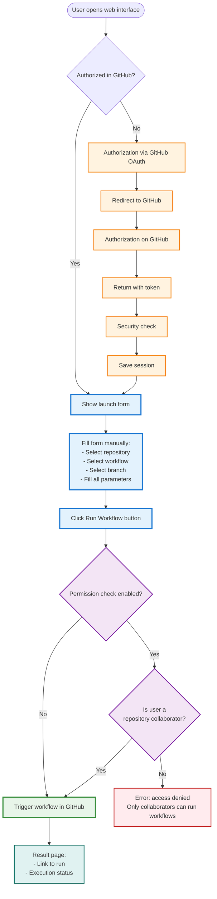
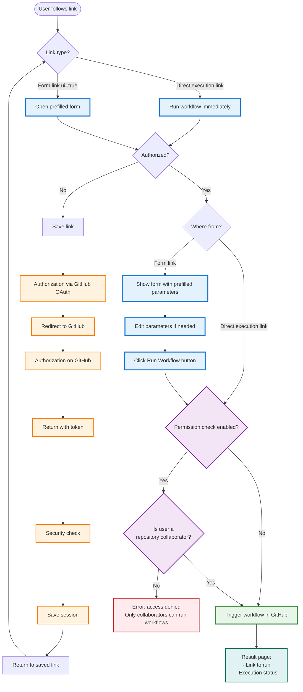
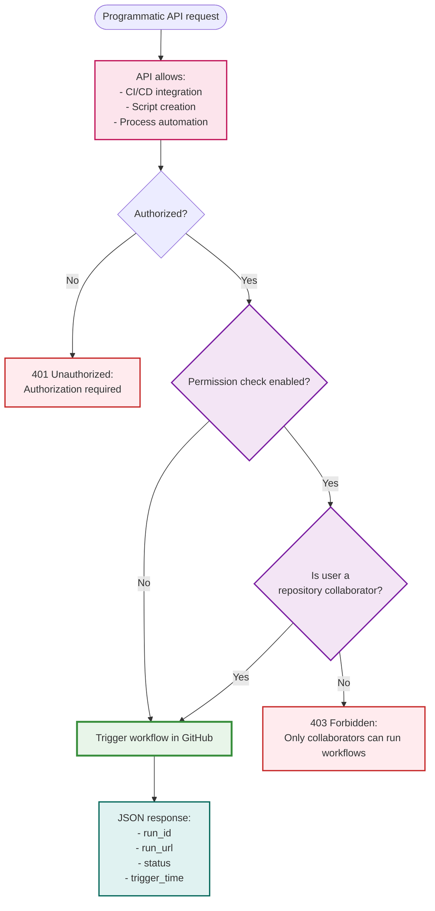
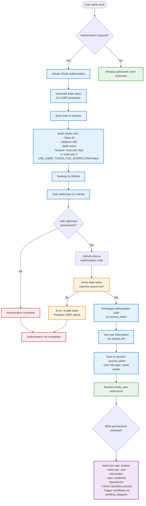
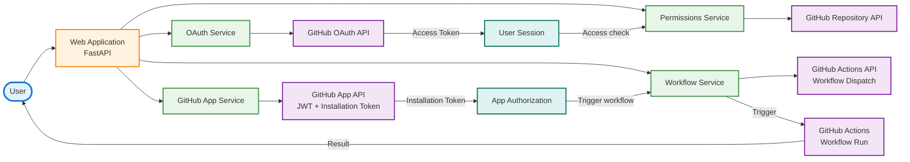

# GitHub Action Executor

Web interface for running GitHub Actions workflows with collaborator permission checks and test selection capabilities.

## Features

- ✅ Authorization via GitHub OAuth
- ✅ Collaborator permission check before workflow execution (configurable)
- ✅ Dynamic loading of workflows and branches from repository
- ✅ Automatic detection of workflow inputs from YAML
- ✅ Branch filtering by regex patterns
- ✅ Workflow execution as user or GitHub App (configurable)
- ✅ Web form with dynamic fields for all workflow inputs
- ✅ REST API for programmatic access
- ✅ Caching of branches and workflows for improved performance
- ✅ Ready for deployment in Yandex Cloud

## Quick Start

### 1. Installation

```bash
# Clone the repository
git clone <repository-url>
cd github_action_executor

# Install dependencies
pip install -r requirements.txt
```

### 2. GitHub Setup

**Create OAuth App:**
1. Go to [GitHub Settings > Developer settings > OAuth Apps](https://github.com/settings/developers)
2. Click "New OAuth App"
3. Fill in:
   - **Application name**: GitHub Action Executor
   - **Homepage URL**: `http://localhost:8000`
   - **Authorization callback URL**: `http://localhost:8000/auth/github/callback`
4. Save **Client ID** and **Client Secret**

**Create GitHub App:**
1. Go to [GitHub Settings > Developer settings > GitHub Apps](https://github.com/settings/apps)
2. Click "New GitHub App"
3. Fill in:
   - **GitHub App name**: GitHub Action Executor
   - **Homepage URL**: `http://localhost:8000`
   - **Permissions**:
     - **Actions**: Read and write
     - **Contents**: Read-only
     - **Metadata**: Read-only
4. Save **App ID**
5. Generate **Private key** and download the `.pem` file
6. Install the application in repository or organization
7. Find **Installation ID** in the installation URL

### 3. Environment Variables Configuration

Create a `.env` file:

```bash
# Required
SECRET_KEY=<generate using: openssl rand -hex 32>
GITHUB_CLIENT_ID=<from OAuth App>
GITHUB_CLIENT_SECRET=<from OAuth App>
GITHUB_APP_ID=<from GitHub App>
GITHUB_APP_INSTALLATION_ID=<from installation URL>
GITHUB_APP_PRIVATE_KEY_PATH=github-app-private-key.pem
```

### 4. Run

```bash
python app.py
```

The application will be available at: http://localhost:8000

## User Flow Descriptions

Below are user flow diagrams for different workflow execution scenarios:

### Scenario 1: Execution via Web Interface (Manual Full Form Fill)

**Description:**
- User opens the web interface
- If not authorized → automatic redirect to GitHub for authorization
- After authorization, a form is shown with repository, workflow, branch and parameter selection
- The form automatically loads available workflows and branches
- After filling and clicking "Run" → permission check → workflow execution
- Result page is shown with a link to the run in GitHub Actions



### Scenario 2: Execution via Direct Link from PR/Documentation

**Description:**
- User clicks a ready-made link (e.g., from documentation or badge)
- If not authorized → automatic authorization with return to the link
- Workflow runs automatically with parameters from the link
- Result page is displayed
- **Why this is needed**: Can create bookmarks or badges for quick launch of frequently used workflows



### Scenario 3: Execution via REST API (for Automation)

**Description:**
- Programmatic access via REST API
- Allows integrating workflow execution into:
  - CI/CD pipelines
  - Automation scripts
  - Other systems and tools
- Returns JSON with execution result
- **Why this is needed**: For automation and integration with other systems



### Scenario 4: How GitHub OAuth Authorization Works

**Description:**
- OAuth authorization process with CSRF attack protection
- Requesting user permissions (read:user and repo scopes)
- Exchanging authorization code for access token
- Storing token in server session
- Automatic return to saved link after authorization



**Required Permissions (OAuth Scopes):**
- `read:user` - reading user information (always required)
- `repo` - repository access (read/write) - required if `USE_USER_TOKEN_FOR_WORKFLOWS=true` (default)
- If `USE_USER_TOKEN_FOR_WORKFLOWS=false`, only `read:user` is sufficient (workflows run as GitHub App)

**Security:**
- State token protects against CSRF attacks
- Access token is stored only in server session
- Token is used for checking repository access

### Scenario 5: Connecting to Project/Organization

**Description:**
- Step-by-step system setup for working with a specific project or organization
- Role separation: app admin creates OAuth App and GitHub App, repository admin installs GitHub App
- Environment variable configuration and private key placement
- Connection verification before starting work

```mermaid
flowchart TD
    Start([System setup for project]) --> WhoSetup{Who sets up?}
    
    WhoSetup -->|App admin| AdminApp[Application Administrator]
    WhoSetup -->|Repo admin| AdminRepo[Repository/Organization Administrator]
    
    AdminApp --> CreateOAuth["1. Create GitHub OAuth App<br/>👤 App Administrator<br/>📍 GitHub Settings → Developer settings → OAuth Apps<br/>🔗 https://github.com/settings/developers"]
    CreateOAuth --> OAuthSettings["OAuth App settings:<br/>- Application name<br/>- Homepage URL<br/>- Authorization callback URL"]
    OAuthSettings --> GetOAuthCreds["Get credentials:<br/>- Client ID<br/>- Client Secret"]
    
    GetOAuthCreds --> CreateGitHubApp["2. Create GitHub App<br/>👤 App Administrator<br/>📍 GitHub Settings → Developer settings → GitHub Apps<br/>🔗 https://github.com/settings/apps"]
    CreateGitHubApp --> AppSettings["GitHub App settings:<br/>- App name<br/>- Homepage URL<br/>- Permissions:<br/>  • Actions: Read and write<br/>  • Contents: Read-only<br/>  • Metadata: Read-only"]
    AppSettings --> GenerateKey[Generate Private Key<br/>and download .pem file]
    GenerateKey --> GetAppID[Get App ID]
    
    GetAppID --> InstallApp["3. Install GitHub App<br/>👤 Repository/Organization Administrator<br/>📍 In repository or organization settings"]
    InstallApp --> ChooseTarget{Where to install?}
    ChooseTarget -->|To repository| InstallRepo["Install to repository<br/>📍 Settings → Integrations → GitHub Apps<br/>🔗 https://github.com/OWNER/REPO/settings/installations"]
    ChooseTarget -->|To organization| InstallOrg["Install to organization<br/>📍 Organization Settings → GitHub Apps<br/>🔗 https://github.com/organizations/ORG/settings/installations"]
    ChooseTarget -->|To account| InstallAccount["Install to account<br/>📍 Settings → Applications → Installed GitHub Apps<br/>🔗 https://github.com/settings/installations"]
    
    InstallRepo --> GetInstallID1["Get Installation ID<br/>📍 From URL after installation<br/>Example: .../installations/12345678"]
    InstallOrg --> GetInstallID2["Get Installation ID<br/>📍 From URL after installation<br/>Example: .../installations/12345678"]
    InstallAccount --> GetInstallID3["Get Installation ID<br/>📍 From URL after installation<br/>Example: .../installations/12345678"]
    
    GetInstallID1 --> ConfigureEnv["4. Configure environment variables<br/>👤 App Administrator<br/>📍 On application server"]
    GetInstallID2 --> ConfigureEnv
    GetInstallID3 --> ConfigureEnv
    
    ConfigureEnv --> EnvVars["Set variables:<br/>- GITHUB_CLIENT_ID<br/>- GITHUB_CLIENT_SECRET<br/>- GITHUB_APP_ID<br/>- GITHUB_APP_INSTALLATION_ID<br/>- GITHUB_APP_PRIVATE_KEY_PATH"]
    EnvVars --> PlaceKey[Place private key<br/>in secure location]
    PlaceKey --> TestConnection["5. Test connection<br/>👤 App Administrator"]
    
    TestConnection --> TestOAuth[Test OAuth authorization]
    TestOAuth --> TestApp[Test GitHub App token]
    TestApp --> TestWorkflow[Test workflow execution]
    TestWorkflow --> Success[System ready for work]
    
    AdminRepo --> InstallApp
    
    classDef adminApp fill:#e3f2fd,stroke:#1976d2,stroke-width:2px
    classDef adminRepo fill:#fff3e0,stroke:#f57c00,stroke-width:2px
    classDef setup fill:#e8f5e9,stroke:#388e3c,stroke-width:2px
    classDef credentials fill:#f3e5f5,stroke:#7b1fa2,stroke-width:2px
    classDef install fill:#e0f2f1,stroke:#00695c,stroke-width:2px
    classDef config fill:#ffebee,stroke:#c62828,stroke-width:2px
    classDef test fill:#fce4ec,stroke:#c2185b,stroke-width:2px
    
    class AdminApp,CreateOAuth,CreateGitHubApp,ConfigureEnv,TestConnection adminApp
    class AdminRepo,InstallApp,ChooseTarget,InstallRepo,InstallOrg,InstallAccount adminRepo
    class OAuthSettings,AppSettings setup
    class GetOAuthCreds,GenerateKey,GetAppID,PlaceKey credentials
    class GetInstallID1,GetInstallID2,GetInstallID3 install
    class EnvVars config
    class TestOAuth,TestApp,TestWorkflow,Success test
```



**Connection Steps:**

1. **Create OAuth App** (App Administrator)
   - Where: GitHub Settings → Developer settings → OAuth Apps
   - Link: https://github.com/settings/developers
   - Purpose: user authorization via OAuth

2. **Create GitHub App** (App Administrator)
   - Where: GitHub Settings → Developer settings → GitHub Apps
   - Link: https://github.com/settings/apps
   - Purpose: running workflows as the application

3. **Install GitHub App** (Repository/Organization Administrator)
   - In repository: Settings → Integrations → GitHub Apps
   - In organization: Organization Settings → GitHub Apps
   - On account: Settings → Applications → Installed GitHub Apps
   - Purpose: provide the application with access to repositories

4. **Configure Environment Variables** (App Administrator)
   - Where: on application server (.env file or environment variables)
   - What to configure: all credentials from previous steps

5. **Verify Connection** (App Administrator)
   - Verify OAuth authorization
   - Verify GitHub App token retrieval
   - Verify workflow execution

### Scenario 6: System Architecture and Component Interaction

**Description:**
- Overall system architecture and interaction between components
- Data flows from user through web application to GitHub API
- Using OAuth tokens for user authorization
- Using GitHub App tokens for workflow execution
- Separation of responsibilities between services



**System Components:**

- **Web Application (FastAPI)** - main application server
- **OAuth Service** - user authorization management
- **GitHub App Service** - JWT generation and installation token retrieval
- **Permissions Service** - repository access permission checks
- **Workflow Service** - workflow execution via GitHub API

**Interaction:**
- User authorizes via OAuth → receives access token
- GitHub App uses JWT to obtain installation token
- Permissions checks access via Repository API
- Workflow Service executes workflow via Actions API

### Key Points

- **Authorization**: Required once via GitHub OAuth, then session is saved
- **Permission Check**: The system checks:
  - Whether the user is a repository collaborator (has access to the repository)
  - Whether the user has read/write permissions on the repository
  - The check is performed via GitHub API before workflow execution
  - Can be disabled via `CHECK_PERMISSIONS=false` setting (not recommended)
- **Security**: All requests are protected against CSRF attacks via state parameter in OAuth
- **Convenience**: After authorization, workflows can be quickly executed without re-login

## Usage

### Via Web Interface

1. Open the web interface
2. Authorize via GitHub (once)
3. Specify repository (format: `owner/repo` or select from list)
4. After selecting repository, the following are automatically loaded:
   - List of available workflows (can be selected from dropdown)
   - List of branches (filtered by `BRANCH_FILTER_PATTERNS`)
5. Select workflow - form automatically updates with fields for all workflow inputs:
   - Text fields for `type: string`
   - Dropdown lists for `type: choice` with options from workflow
   - Checkboxes for `type: boolean`
   - Fields are marked as required if `required: true`
   - Default values are filled if specified in workflow
6. Fill in necessary fields and select branch
7. Click "Run Workflow"
8. Result page opens with execution result and link to GitHub Actions run

### Direct Link (without UI)

You can create a direct link to execute workflow. All parameters except `owner`, `repo`, `workflow_id`, `ref` and `ui` are passed as workflow inputs:

```
http://your-server/workflow/trigger?owner=owner_name&repo=my-repo&workflow_id=ci.yml&ref=main&tests=unit,integration
```

**Example with multiple inputs:**

```
http://your-server/workflow/trigger?owner=owner_name&repo=my-repo&workflow_id=run_tests.yml&ref=main&test_targets=tests/&test_type=pytest&test_size=large&build_preset=relwithdebinfo
```

When clicking the link:
1. If not authorized → redirect to GitHub OAuth
2. After authorization → workflow runs immediately
3. Result page is displayed

**Parameters:**
- `owner` - repository owner (required)
- `repo` - repository name (required)
- `workflow_id` - workflow file ID (required)
- `ref` - branch or tag (default: `main`)
- `ui=true` - open form instead of immediate execution
- Any other parameters are passed as workflow inputs

### Quick Test Launch (Badges)

You can create badges for quick workflow execution. Example:

```markdown
[](http://your-server/?owner=owner&repo=repo&workflow_id=run_tests.yml&test_targets=tests/&test_type=pytest&build_preset=relwithdebinfo)
```

**Link Format:**
- To open form: `http://your-server/?owner=...&repo=...&workflow_id=...&parameters`
- For direct execution: `http://your-server/workflow/trigger?owner=...&repo=...&workflow_id=...&parameters`

## API Endpoints

### Web Interface
- `GET /` - Main page with workflow execution form
- `GET /workflow/trigger` - Universal endpoint for workflow execution (via URL)
  - Parameters: `owner`, `repo`, `workflow_id`, `ref`, and any workflow inputs
  - Supports `Accept: application/json` for JSON response
  - Parameter `ui=true` opens form instead of immediate execution
- `POST /workflow/trigger` - Workflow execution from form

### Authentication
- `GET /auth/github` - Start OAuth authorization
  - Parameter `redirect_after` - URL for redirect after authorization
- `GET /auth/github/callback` - OAuth callback
- `GET /auth/logout` - Logout
- `GET /auth/user` - Information about current user

### REST API
All API endpoints require authentication via session (OAuth).

- `POST /api/trigger` - Programmatic workflow execution (JSON)
  ```json
  {
    "owner": "username",
    "repo": "repo-name",
    "workflow_id": "ci.yml",
    "ref": "main",
    "inputs": {"test_targets": "tests/", "test_type": "pytest"},
    "tests": ["unit", "integration"]  // optional, for backward compatibility
  }
  ```

- `GET /api/branches` - Get list of repository branches
  - Parameters: `owner`, `repo`
  - Uses filtering by `BRANCH_FILTER_PATTERNS` from config
  - Returns: `{"branches": ["main", "stable-1.0", ...]}`

- `GET /api/workflows` - Get list of repository workflows
  - Parameters: `owner`, `repo`
  - Returns: `{"workflows": [{"id": "ci.yml", "name": "CI", "path": ".github/workflows/ci.yml", "state": "active"}, ...]}`

- `GET /api/workflow-info` - Get workflow information including inputs
  - Parameters: `owner`, `repo`, `workflow_id`
  - Returns: `{"found": true, "inputs": {...}, "has_workflow_dispatch": true}`
  - Inputs include: `type`, `description`, `required`, `default`, `options` (for choice)

- `GET /api/find-run` - Find workflow run by execution time
  - Parameters: `owner`, `repo`, `workflow_id`, `trigger_time` (ISO format), `ref` (optional)
  - Returns: `{"found": true, "run_id": 123456, "run_url": "...", "status": "completed", "conclusion": "success"}`

- `GET /api/check-permissions` - Check repository access permissions
  - Parameters: `owner`, `repo`
  - Returns: `{"has_access": true, "can_trigger": true, "username": "...", "check_enabled": true}`

### Health Check
- `GET /health` - Health check
  - Returns: `{"status": "ok"}`

## API Usage Examples

### Programmatic Workflow Execution

```bash
# First authorize through web interface, then use session

curl -X POST http://localhost:8000/api/trigger \
  -H "Content-Type: application/json" \
  -H "Cookie: session=<your-session-cookie>" \
  -d '{
    "owner": "username",
    "repo": "repo-name",
    "workflow_id": "ci.yml",
    "ref": "main",
    "inputs": {
      "test_targets": "tests/",
      "test_type": "pytest",
      "test_size": "large"
    }
  }'
```

### Getting List of Branches

```bash
curl "http://localhost:8000/api/branches?owner=username&repo=repo-name" \
  -H "Cookie: session=<your-session-cookie>"
```

### Getting List of Workflows

```bash
curl "http://localhost:8000/api/workflows?owner=username&repo=repo-name" \
  -H "Cookie: session=<your-session-cookie>"
```

### Getting Workflow Information

```bash
curl "http://localhost:8000/api/workflow-info?owner=username&repo=repo-name&workflow_id=ci.yml" \
  -H "Cookie: session=<your-session-cookie>"
```

### Checking Access Permissions

```bash
curl "http://localhost:8000/api/check-permissions?owner=username&repo=repo-name" \
  -H "Cookie: session=<your-session-cookie>"
```

## Configuration

### Environment Variables

All settings can be configured via environment variables:

| Variable | Description | Default | Required |
|----------|-------------|---------|----------|
| `SECRET_KEY` | Secret key for sessions | - | ✅ |
| `GITHUB_CLIENT_ID` | OAuth Client ID | - | ✅ |
| `GITHUB_CLIENT_SECRET` | OAuth Client Secret | - | ✅ |
| `GITHUB_APP_ID` | GitHub App ID | - | ✅ |
| `GITHUB_APP_INSTALLATION_ID` | Installation ID | - | ✅ |
| `GITHUB_APP_PRIVATE_KEY_PATH` | Path to private key | - | ✅ |
| `GITHUB_CALLBACK_URL` | OAuth callback URL | `http://localhost:8000/auth/github/callback` | ❌ |
| `DEFAULT_REPO_OWNER` | Default repository owner | - | ❌ |
| `DEFAULT_REPO_NAME` | Default repository name | - | ❌ |
| `DEFAULT_WORKFLOW_ID` | Default workflow ID | - | ❌ |
| `HOST` | Host to run on | `0.0.0.0` | ❌ |
| `PORT` | Port to run on | `8000` | ❌ |
| `AUTO_OPEN_RUN` | Automatically open run link | `true` | ❌ |
| `BRANCH_FILTER_PATTERNS` | Regex patterns for branch filtering (comma-separated) | `^main$,^stable-.*,^stream-.*` | ❌ |
| `CHECK_PERMISSIONS` | Check collaborator permissions | `true` | ❌ |
| `USE_USER_TOKEN_FOR_WORKFLOWS` | Run as user | `true` | ❌ |

### Branch Filtering Configuration

By default, only branches `main`, `stable-*` and `stream-*` are shown. To change this behavior:

```bash
# Show all branches
unset BRANCH_FILTER_PATTERNS

# Or set your own patterns
export BRANCH_FILTER_PATTERNS="^main$,^develop$,^release-.*"
```

### Running as User vs GitHub App

By default, workflows run as the authorized user (`USE_USER_TOKEN_FOR_WORKFLOWS=true`). This means:
- In GitHub Actions history, workflow will be shown as run by the user
- Workflow has user permissions

If you set `USE_USER_TOKEN_FOR_WORKFLOWS=false`:
- Workflows run as GitHub App
- In history, shown as run by bot
- Workflow has GitHub App permissions

## Workflow Configuration

Your workflow must support `workflow_dispatch` with inputs. The application automatically detects all inputs from YAML and creates corresponding fields in the form.

**Example of a simple workflow:**

```yaml
name: CI Tests

on:
  workflow_dispatch:
    inputs:
      tests:
        description: 'Tests to run'
        required: false
        type: string
        default: 'unit'

jobs:
  test:
    runs-on: ubuntu-latest
    steps:
      - uses: actions/checkout@v4
      - name: Run tests
        run: |
          echo "Running tests: ${{ inputs.tests }}"
          # Your commands to run tests
```

**Example workflow with different input types:**

```yaml
name: Advanced Workflow

on:
  workflow_dispatch:
    inputs:
      test_targets:
        description: 'Test targets to run'
        required: true
        type: string
      test_type:
        description: 'Type of tests'
        required: false
        type: choice
        options:
          - pytest
          - unittest
          - integration
        default: 'pytest'
      test_size:
        description: 'Test size'
        required: false
        type: choice
        options:
          - small
          - medium
          - large
      build_preset:
        description: 'Build preset'
        required: false
        type: string
        default: 'release'
      enable_debug:
        description: 'Enable debug mode'
        required: false
        type: boolean
        default: false

jobs:
  test:
    runs-on: ubuntu-latest
    steps:
      - uses: actions/checkout@v4
      - name: Run tests
        run: |
          echo "Test targets: ${{ inputs.test_targets }}"
          echo "Test type: ${{ inputs.test_type }}"
          echo "Test size: ${{ inputs.test_size }}"
          echo "Build preset: ${{ inputs.build_preset }}"
          echo "Debug: ${{ inputs.enable_debug }}"
```

The application will automatically create a form with:
- Text field for `test_targets` (required)
- Dropdown list for `test_type` with options pytest/unittest/integration
- Dropdown list for `test_size` with options small/medium/large
- Text field for `build_preset` with default value
- Checkbox for `enable_debug`

## Local Run

```bash
# Simple run
python app.py

# Or with uvicorn
uvicorn app:app --host 0.0.0.0 --port 8000 --reload
```

The application will be available at: http://localhost:8000

### Running in Background (after SSH disconnect)

#### Option 1: Using start.sh/stop.sh scripts (recommended)

```bash
# Run in background
./start.sh

# Check logs
tail -f nohup.out

# Stop
./stop.sh
```

The script automatically:
- Activates virtual environment
- Runs application with `nohup` (won't terminate on SSH disconnect)
- Saves process PID to `app.pid` file
- Writes logs to `nohup.out`

#### Option 2: Manual run with nohup

```bash
# Activate virtual environment
source venv/bin/activate

# Run with nohup
nohup uvicorn app:app --host 0.0.0.0 --port 8000 > nohup.out 2>&1 &

# Save PID (will be displayed after startup)
echo $! > app.pid

# To stop
kill $(cat app.pid)
```

#### Option 3: Using systemd (for production) ⭐ RECOMMENDED

**Advantages:**
- ✅ Automatic startup on system reboot
- ✅ Automatic restart on application crash
- ✅ Management via systemctl
- ✅ Logs in systemd journal

**Setup:**

Adapt `/github-action-executor.service`

**Service Management:**

```bash
# Start service
sudo systemctl start github-action-executor

# Stop service
sudo systemctl stop github-action-executor

# Restart service
sudo systemctl restart github-action-executor

# Check status
sudo systemctl status github-action-executor

# Enable autostart on system boot
sudo systemctl enable github-action-executor

# Disable autostart
sudo systemctl disable github-action-executor

# View logs
sudo journalctl -u github-action-executor -f

# View last 50 log lines
sudo journalctl -u github-action-executor -n 50
```

**If you need to change settings:**

1. Edit the service file:
```bash
# Edit the project source file:
nano github-action-executor.service

# Replace placeholders:
# - YOUR_USERNAME with your username
# - /path/to/github_action_executor with full path to project directory

# Copy to systemd:
sudo cp github-action-executor.service /etc/systemd/system/
```

2. Reload systemd and restart service:
```bash
sudo systemctl daemon-reload
sudo systemctl restart github-action-executor
```

#### Option 4: Using screen or tmux

```bash
# Install screen (if not installed)
sudo apt-get install screen  # for Ubuntu/Debian
# or
sudo yum install screen      # for CentOS/RHEL

# Start screen session
screen -S gax

# Inside screen, run the application
source venv/bin/activate
uvicorn app:app --host 0.0.0.0 --port 8000

# Detach from screen: press Ctrl+A, then D

# Return to session
screen -r gax

# List all sessions
screen -ls
```

## Docker Usage

```bash
# Build image
docker build -t github-action-executor .

# Run container
docker run -p 8000:8000 --env-file .env \
  -v $(pwd)/github-app-private-key.pem:/app/github-app-private-key.pem:ro \
  github-action-executor
```

Or use docker-compose:

```bash
docker-compose up -d
```

## Deployment to Yandex Cloud

For detailed deployment instructions to Yandex Cloud, see [yandex-cloud-deploy.md](yandex-cloud-deploy.md)

### Quick Start with Cloud Run:

1. Build Docker image
2. Upload to Yandex Container Registry
3. Create Cloud Run service
4. Configure environment variables
5. Create API Gateway for public access

## Security

- ✅ GitHub App used instead of PAT
- ✅ Collaborator permission check before execution (configurable via `CHECK_PERMISSIONS`)
- ✅ OAuth for user authentication
- ✅ Session-based authentication
- ✅ CSRF protection via state parameter in OAuth
- ⚠️ **Important**: Store GitHub App private key in a secure place (Yandex Lockbox, Secrets Manager)
- ⚠️ **Important**: Use a strong `SECRET_KEY` in production

## Troubleshooting

### Error "Must have admin rights to Repository"

If you get an error **"Failed to trigger workflow: Must have admin rights to Repository"**, this message from GitHub API can be misleading. In fact, to run a workflow as a user via GitHub API, **Write** permission (or higher) is required, not necessarily Admin.

**Solution:**

#### 1. Enable Actions in Organization

If the repository belongs to an organization, you need to configure permissions at the organization level:

1. **Go to:** Organization Settings → Policies → Actions
   - (in the left menu "Code, planning, and automation → Actions")
2. **Find the "Actions permissions" section**
3. **Enable:**
   - "Allow all actions and reusable workflows"
   - or "Allow selected actions..." — if you want to restrict

#### 2. Allow Organization Members to Run Workflows

In the same section:

1. **Find the "Workflow permissions" subsection**
2. **Set:**
   - "Read and write permissions" (if workflow should push, create PRs, etc.)
3. **Check the box:**
   - "Allow GitHub Actions to create and approve pull requests"

#### 3. User Must Have at Least Write Permissions on Repository

**Important:**
- Read is not enough — button won't appear
- Write / Maintainer / Admin — button will appear

**Check:**
- Repo → Settings → Collaborators & teams → Teams / People

**User must have:**
- Write (or higher)
- and be a member of your organization (if repository is in an organization)

**How to grant permissions:**
1. Go to repository: `https://github.com/{owner}/{repo}`
2. Settings → Collaborators and teams (or Manage access)
3. Add user with **Write** permissions (sufficient for running workflow, Admin not required)
4. User must accept the invitation

**Alternative solution:**
- Set `USE_USER_TOKEN_FOR_WORKFLOWS=false` in configuration
- Then workflows will run as GitHub App, and admin rights won't be required
- GitHub App must have Actions: Read and write permissions in settings

### OAuth App access restrictions

If you see an error that the organization has enabled access restrictions for OAuth applications:

**For organization administrators:**
1. Go to organization settings: `https://github.com/organizations/ORGANIZATION_NAME/settings/oauth_application_policy`
2. Find your OAuth App in the "Third-party access" list
3. Click "Grant" or "Approve" for your application
4. Detailed documentation: https://docs.github.com/articles/restricting-access-to-your-organization-s-data/

**For regular users:**
- Contact the organization administrator to request OAuth App approval
- The administrator should go to: `Settings → Third-party access → OAuth Apps` and approve the application

**Alternative:**
- Use GitHub App instead of OAuth App (GitHub Apps don't require organization approval if installed in the repository)

## Project Structure

```
github_action_executor/
├── app.py                      # Main application file (FastAPI)
├── config.py                    # Application configuration
├── backend/
│   ├── routes/                  # API routes
│   │   ├── auth.py              # OAuth authorization
│   │   ├── workflow.py          # Workflow execution (GET/POST)
│   │   └── api.py               # REST API endpoints
│   └── services/                # Business logic
│       ├── github_app.py        # GitHub App tokens and JWT
│       ├── github_oauth.py      # OAuth authorization
│       ├── permissions.py       # Access permission checks
│       ├── workflow.py          # Workflow execution and run search
│       ├── workflow_info.py     # Getting workflow information (inputs)
│       ├── workflows.py         # Getting list of workflows
│       ├── branches.py          # Getting list of branches with filtering
│       └── cache.py             # Caching (in-memory)
├── frontend/
│   ├── templates/               # HTML templates (Jinja2)
│   │   ├── index.html           # Main page with form
│   │   └── result.html          # Execution result page
│   └── static/                  # Static files
│       ├── style.css            # Styles
│       └── fav.jpeg             # Icon
├── requirements.txt             # Python dependencies
├── Dockerfile                   # Docker image
├── docker-compose.yml           # Docker Compose configuration
├── serverless.yaml              # Yandex Cloud Functions configuration
├── github-action-executor.service  # systemd service file
├── start.sh                     # Background startup script
├── stop.sh                      # Stop script
├── QUICKSTART.md                # Quick start
├── yandex-cloud-deploy.md       # Deployment instructions for Yandex Cloud
└── README.md                    # Documentation
```

## License

MIT

## Support

If you have questions or issues, create an issue in the repository.
