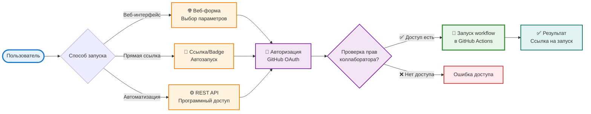

# GitHub Action Executor

Веб-интерфейс для удобного запуска GitHub Actions workflows с проверкой прав доступа.

## Зачем это нужно?

**Проблема:** Запуск GitHub Actions workflows обычно требует:
- Перехода в GitHub UI
- Навигации по репозиторию
- Ручного заполнения всех параметров
- Повторения этих действий для каждого запуска

**Решение:** GitHub Action Executor предоставляет:
- 🚀 **Быстрый запуск** через веб-интерфейс или прямые ссылки
- 🔐 **Безопасность** - проверка прав коллаборатора перед запуском
- 🎯 **Удобство** - автоматическое определение параметров workflow
- 🔗 **Интеграция** - REST API для автоматизации
- 📱 **Badges** - создание кнопок для быстрого запуска в документации

## Как это работает?



### 1. Запуск через веб-интерфейс

Самый простой способ для ручного запуска:

1. Откройте веб-интерфейс
2. Авторизуйтесь через GitHub (один раз)
3. Выберите репозиторий, workflow и ветку
4. Форма автоматически подгрузит все доступные параметры
5. Заполните параметры и нажмите "Запустить"
6. Получите ссылку на запуск в GitHub Actions

**Преимущества:**
- Автоматическое определение всех параметров workflow из YAML
- Динамические поля (текст, выбор, чекбоксы) в зависимости от типа параметра
- Фильтрация веток по настраиваемым паттернам
- Проверка прав доступа перед запуском

### 2. Запуск по прямой ссылке

Идеально для создания закладок или badges в документации:

```
http://your-server/workflow/trigger?owner=owner&repo=my-repo&workflow_id=ci.yml&ref=main&test_type=pytest
```

**Как это работает:**
- Пользователь переходит по ссылке
- Если не авторизован → автоматическая авторизация с возвратом
- Workflow запускается автоматически с параметрами из ссылки
- Показывается результат запуска

**Пример использования:**
- Создайте badge в README для быстрого запуска тестов
- Добавьте ссылку в PR для запуска проверок
- Используйте в документации для демонстрации workflows

### 3. Автоматизация через REST API

Для интеграции в CI/CD пайплайны и скрипты:

```bash
curl -X POST http://your-server/api/trigger \
  -H "Content-Type: application/json" \
  -H "Cookie: session=<your-session>" \
  -d '{
    "owner": "username",
    "repo": "repo-name",
    "workflow_id": "ci.yml",
    "ref": "main",
    "inputs": {
      "test_targets": "tests/",
      "test_type": "pytest"
    }
  }'
```

**Применение:**
- Интеграция в CI/CD пайплайны
- Автоматизация тестирования
- Создание скриптов для массового запуска
- Интеграция с другими системами

## Безопасность

- ✅ **Проверка прав** - только коллабораторы репозитория могут запускать workflows
- ✅ **OAuth авторизация** - безопасная авторизация через GitHub
- ✅ **CSRF защита** - защита от межсайтовых атак
- ✅ **GitHub App** - использование GitHub App вместо личных токенов

## Быстрый старт

### 1. Установка

```bash
git clone <repository-url>
cd github_action_executor
pip install -r requirements.txt
```

### 2. Настройка GitHub

**Создайте OAuth App:**
- Перейдите в [GitHub Settings > Developer settings > OAuth Apps](https://github.com/settings/developers)
- Создайте новое приложение
- Укажите callback URL: `http://localhost:8000/auth/github/callback`
- Сохраните Client ID и Client Secret

**Создайте GitHub App:**
- Перейдите в [GitHub Settings > Developer settings > GitHub Apps](https://github.com/settings/apps)
- Создайте новое приложение с правами:
  - Actions: Read and write
  - Contents: Read-only
  - Metadata: Read-only
- Сгенерируйте Private key и установите приложение в репозиторий
- Сохраните App ID и Installation ID

### 3. Настройка переменных окружения

Создайте файл `.env`:

```bash
SECRET_KEY=<сгенерируйте: openssl rand -hex 32>
GITHUB_CLIENT_ID=<из OAuth App>
GITHUB_CLIENT_SECRET=<из OAuth App>
GITHUB_APP_ID=<из GitHub App>
GITHUB_APP_INSTALLATION_ID=<из URL установки>
GITHUB_APP_PRIVATE_KEY_PATH=github-app-private-key.pem
```

### 4. Запуск

```bash
python app.py
```

Приложение будет доступно по адресу: http://localhost:8000

## Возможности

- ✅ Авторизация через GitHub OAuth
- ✅ Проверка прав коллаборатора перед запуском
- ✅ Динамическая загрузка workflows и веток
- ✅ Автоматическое определение workflow inputs из YAML
- ✅ Фильтрация веток по regex-паттернам
- ✅ Веб-форма с динамическими полями
- ✅ REST API для программного доступа
- ✅ Кэширование для улучшения производительности
- ✅ Готово для развертывания в Yandex Cloud

## Документация

📖 **Подробная документация:** [README-EXTENDED.md](README-EXTENDED.md)

Расширенная документация включает:
- Детальные диаграммы пользовательских потоков
- Полное описание API endpoints
- Настройка конфигурации
- Инструкции по развертыванию
- Решение проблем

## Примеры использования

### Badge в README

```markdown
[](http://your-server/?owner=owner&repo=repo&workflow_id=run_tests.yml&test_type=pytest)
```

### Прямая ссылка для запуска

```
http://your-server/workflow/trigger?owner=owner&repo=my-repo&workflow_id=ci.yml&ref=main&tests=unit,integration
```

### Workflow с параметрами

Ваш workflow должен поддерживать `workflow_dispatch`:

```yaml
name: CI Tests

on:
  workflow_dispatch:
    inputs:
      test_type:
        description: 'Type of tests'
        required: false
        type: choice
        options:
          - pytest
          - unittest
        default: 'pytest'

jobs:
  test:
    runs-on: ubuntu-latest
    steps:
      - uses: actions/checkout@v4
      - name: Run tests
        run: echo "Running ${{ inputs.test_type }}"
```

## Лицензия

MIT

## Поддержка

Если у вас возникли вопросы или проблемы, создайте issue в репозитории.

